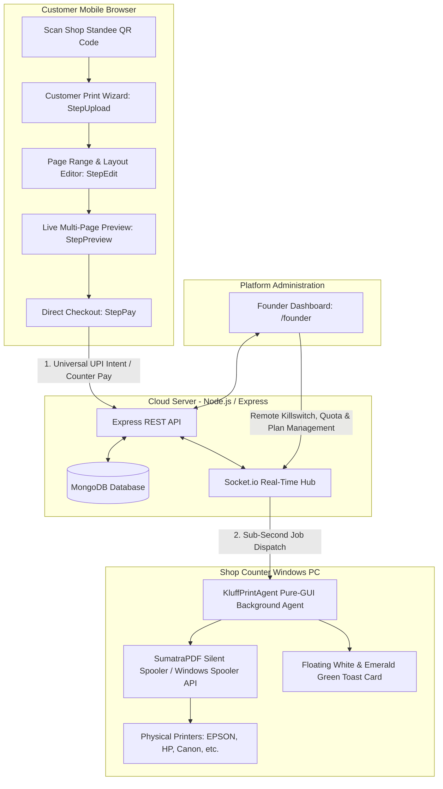
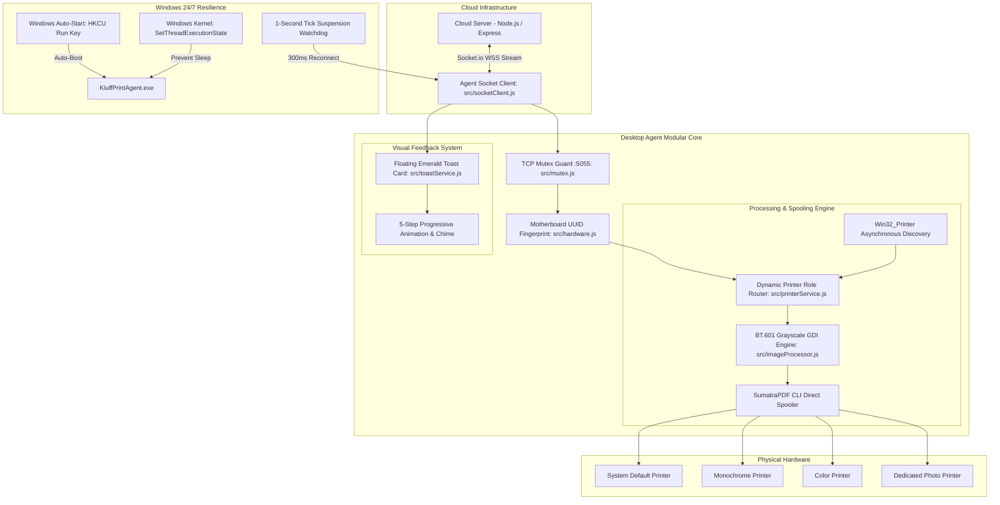

# ⚡ AutoPrint (Kluff) — Autonomous Cloud-to-Spooler Printing Engine

> **Zero-Touch, Real-Time Self-Service Print Ecosystem for Stationery Shops & Print Centers**  
> Enables customers to scan a shop QR code, configure page layouts, upload multi-file documents or photos, and dispatch jobs directly to physical Windows desktop printers without installing drivers, waiting in queues, or requiring manual shopkeeper intervention.

---

## 📑 Table of Contents
1. [Architecture Overview](#-architecture-overview)
2. [Print Agent Architecture & Core Modules](#-print-agent-architecture--core-modules)
3. [Zero-Console Pure GUI & Desktop Notification Card](#-zero-console-pure-gui--desktop-notification-card)
4. [Sleep, Wake-Up & 24/7 NAT Resilience](#-sleep-wake-up--247-nat-resilience)
5. [Founder Platform & SaaS Licensing Controls](#-founder-platform--saas-licensing-controls)
6. [Folder & Project Structure](#-folder--project-structure)
7. [Getting Started & Local Setup](#-getting-started--local-setup)
8. [Windows Desktop Print Agent Installation](#-windows-desktop-print-agent-installation)
9. [API & WebSocket Specifications](#-api--websocket-specifications)
10. [Changelog & Recent Milestones](#-changelog--recent-milestones)

---

## 🏗 Architecture Overview



---

## 🖨 Print Agent Architecture & Core Modules

The **AutoPrint Desktop Agent** (`print-agent/`) bridges cloud print requests with local Windows printer spoolers without requiring port forwarding or cloud-side printer drivers.



### Modular Codebase Breakdown (`print-agent/src/`):
* **`src/activationService.js`:** Floating White & Emerald Green WPF modal for 1-click counter terminal pairing with shop tokens.
* **`src/toastService.js`:** Autonomous floating WPF notification card sliding up above the Windows taskbar with real-time job progress, payment badges, timestamps, and auto-dismiss countdown.
* **`src/socketClient.js`:** High-speed WebSocket client with 15s bidirectional NAT keepalive ping-pong, 300ms sleep wake-up recovery, and remote founder killswitch listeners.
* **`src/printerService.js`:** Dynamic Windows printer discovery and silent background spooling via SumatraPDF.
* **`src/imageProcessor.js`:** High-definition BT.601 perceptual grayscale photo engine using Windows GDI ColorMatrix for photographic depth on monochrome printers.
* **`src/mutex.js`:** Port 5055 TCP single-instance mutex preventing duplicate agent processes on the same computer.
* **`src/hardware.js`:** Motherboard UUID & MachineGuid hardware fingerprinting.
* **`src/logger.js`:** File and stream logging with automatic 5MB log rotation (`agent.log`).

---

## 🎨 Zero-Console Pure GUI & Desktop Notification Card

To maintain a professional POS experience on customer-facing shop counter screens:
* **Subsystem: 2 Windows GUI Binary:** `KluffPrintAgent.exe` is patched at build time (PE header byte offset `0x3C + 92 = 2`), ensuring Windows treats it as a pure GUI executable without opening a command prompt window.
* **Zero Command Prompt Flashes:** All sub-processes use `execFile` or `spawn(..., { shell: false, windowsHide: true })`, bypassing `cmd.exe` entirely.
* **Floating Notification Toast (`toast-ui.ps1`):**
  * Displays file name, page count, price, color mode, copies, and payment badge (`UPI Mode` / `Cash Mode`).
  * 5-step animated timeline: *1. File Received ➔ 2. Payment Accepted ➔ 3. Now Printing ➔ 4. Files Erased ➔ 5. Job Completed*.
  * Built-in audio chime (`System.Media.SystemSounds.Asterisk`) and 15-second countdown dismiss button (`Close (15)`).

---

## ⚡ Sleep, Wake-Up & 24/7 NAT Resilience

1. **The 6-Hour Idle Problem Solved:** Retail shop routers (JioFiber, Airtel, TP-Link) drop idle TCP tables after 15–30 minutes of silence. The agent sends an active `agent-ping` packet every 15 seconds, keeping the router connection permanently open 24/7/365.
2. **System Sleep / Wake-up Watchdog:** A 1-second interval checks clock skew. If the PC was asleep (e.g. laptop lid closed), clock delta jumps `> 3500ms`. The agent instantly discards the dead socket and re-establishes a fresh WebSocket connection within **300ms**.
3. **Hardware Sleep Prevention (`SetThreadExecutionState`):** On startup, the agent notifies Windows Kernel Power Management (`ES_CONTINUOUS | ES_SYSTEM_REQUIRED`). The counter PC display can turn off to save energy, but the CPU, motherboard, and Wi-Fi adapter remain awake.
4. **Server-Side Missed Job Auto-Flush:** If a customer submits a print job while the agent PC is booting up or reconnecting, the job is saved as `PENDING`. The millisecond the agent connects, the server flushes all pending jobs immediately.

---

## 👑 Founder Platform & SaaS Licensing Controls

The system includes a dedicated administrative management console at `/founder`:
* **Remote Terminal Killswitch:** Platform administrators can instantly suspend or unlock counter printing remotely via WebSocket command (`agent-control-command: LOCK / UNLOCK`).
* **Subscription & Quota Management:** Supports `TRIAL`, `MONTHLY`, `PRO`, and `UNLIMITED` plans.
* **Dual Expiry Watchdog:** Enforces 24-hour time limits and 10-page quotas strictly for free trial shops while keeping unlimited and paid shops running uninterrupted.
* **Hardware Fingerprinting:** Prevents token piracy by tying terminal pairing tokens to motherboard UUIDs.

---

## 📁 Folder & Project Structure

```text
kluff/
├── client/                     # React + Vite customer frontend & owner dashboard
│   ├── src/
│   │   ├── components/customer/
│   │   │   ├── ProgressBar.jsx  # Multi-step checkout progress header
│   │   │   ├── SafeSlider.jsx   # Touch-friendly number of copies slider
│   │   │   ├── StepUpload.jsx   # Document & photo upload area
│   │   │   ├── StepEdit.jsx     # Print settings, duplex discount & page ranges
│   │   │   ├── StepPreview.jsx  # PDF.js multi-page canvas previewer
│   │   │   ├── StepPay.jsx      # Clean UPI intent checkout & counter pay
│   │   │   └── StepTracking.jsx # Real-time print job status tracker
│   │   ├── pages/
│   │   │   ├── CustomerPrint.jsx # Orchestrator page for customer workflow
│   │   │   ├── FounderDashboard.jsx # SaaS platform management & shop controls
│   │   │   ├── FounderLogin.jsx     # Secure founder portal authentication
│   │   │   ├── ShopDashboard.jsx    # Live print queue & pricing controls
│   │   │   └── Login.jsx / Register.jsx # Shopkeeper authentication
│   │   └── utils/
│   │       └── fileStorage.js   # IndexedDB client-side document persistence
├── print-agent/                # Windows desktop background print agent
│   ├── AGENT_ARCHITECTURE.md   # Deep-dive desktop agent specification
│   ├── KluffPrintAgent.exe     # Standalone compiled Pure-GUI agent binary
│   ├── config.json             # Shop token & printer hardware mapping
│   ├── index.js                # Core bootstrapper, mutex & heartbeat
│   ├── install-autostart.bat   # 1-click Windows startup registration & power policy
│   ├── uninstall-autostart.bat # Uninstaller for auto-start
│   ├── start-agent.bat         # Direct background launcher
│   ├── start-agent.vbs         # Headless silent launcher
│   ├── scripts/
│   │   ├── activate-ui.ps1     # Terminal pairing dialog (White & Emerald)
│   │   ├── toast-ui.ps1        # Real-time 5-step floating desktop notification card
│   │   ├── convert-gray.ps1    # GDI BT.601 perceptual grayscale engine
│   │   └── keep-awake.ps1      # Win32 SetThreadExecutionState power enforcer
│   └── src/
│       ├── activationService.js# Terminal activation caller
│       ├── toastService.js     # Desktop notification manager
│       ├── socketClient.js     # Real-time WebSocket relay & auto-healing
│       ├── printerService.js   # Windows printer discovery & spooler
│       ├── imageProcessor.js   # Image-to-PDF & photographic depth engine
│       ├── hardware.js         # Hardware UUID & machine fingerprinting
│       ├── mutex.js            # Port 5055 single instance guard
│       ├── config.js           # Configuration loader & asset unpacker
│       └── logger.js           # File logger with rotation
├── server/                     # Node.js + Express + Socket.io backend
│   ├── models/
│   │   ├── Device.js           # Terminal hardware registration schema
│   │   ├── PrintJob.js         # MongoDB schema for print records & status
│   │   ├── QRSession.js        # Ephemeral customer session tokens
│   │   └── Shop.js             # Merchant account, subscription & pricing schema
│   ├── routes/
│   │   ├── founder.js          # Founder subscription & remote lock APIs
│   │   ├── dashboard.js        # Statistics, history & printer setup APIs
│   │   ├── printJob.js         # Upload, price calculation & agent dispatch
│   │   ├── session.js          # QR token validation & session generation
│   │   └── shop.js             # Shop metadata query endpoints
│   ├── sockets/
│   │   └── agentSocket.js      # Socket.io connection broker & pending job auto-flush
│   └── server.js               # Main HTTP & WebSocket server entrypoint
├── .gitignore                  # Git ignore rules
└── package.json                # Root project orchestration
```

---

## 🛠 Getting Started & Local Setup

### Prerequisites
* **Node.js:** v18.x or higher installed.
* **MongoDB:** Community Server running locally or MongoDB Atlas URI.
* **Git:** Installed and available in terminal path.

### 1. Install Dependencies
```bash
npm run install:all
```

### 2. Environment Configuration
Create `server/.env`:
```env
PORT=5000
MONGO_URI=mongodb://localhost:27017/kluff
JWT_SECRET=your_secure_jwt_secret_key_here
SERVER_URL=http://localhost:5000
FOUNDER_PASSWORD=your_founder_password_here
```

### 3. Running Development Stack
```bash
npm run dev
```

### 4. 🔗 Important System Links & Access Portals

| Portal | Direct URL | Description & Access |
|---|---|---|
| 📱 **Customer Print Portal** | [`http://localhost:5173/print/test-shop-token-123`](http://localhost:5173/print/test-shop-token-123) | Customer mobile upload wizard (Upload, Edit, Preview, UPI Pay) |
| ⚡ **Dev Test Shortcut** | [`http://localhost:5173/test`](http://localhost:5173/test) | Quick redirect directly to customer active shop session |
| 🏪 **Shop Owner Dashboard** | [`http://localhost:5173/dashboard`](http://localhost:5173/dashboard) | Live print queue, daily revenue, printer routing, and per-page rates |
| 🔑 **Shopkeeper Login** | [`http://localhost:5173/login`](http://localhost:5173/login) | Merchant login (`test@shop.com` / `123456`) |
| 📝 **New Shop Registration** | [`http://localhost:5173/register`](http://localhost:5173/register) | Onboard new shop partner and generate initial QR token |
| 👑 **Master Founder Dashboard** | [`http://localhost:5173/founder`](http://localhost:5173/founder) | Platform admin: Remote terminal killswitches, quotas & subscriptions |
| 🔐 **Founder Login** | [`http://localhost:5173/founder/login`](http://localhost:5173/founder/login) | Authenticate into master founder administrative portal |
| 🩺 **Backend Health API** | [`http://localhost:5000/health`](http://localhost:5000/health) | Real-time cloud server uptime and database connectivity check |

---

## 🚀 Windows Desktop Print Agent Installation

### Zero-Touch Auto-Start Deployment:
1. Copy `print-agent/` to the counter PC.
2. Double-click **`install-autostart.bat`**.
   * Registers `KluffPrintAgent.exe` in Windows User Startup (`HKCU\Software\Microsoft\Windows\CurrentVersion\Run`).
   * Configures Windows AC Power Policy (`powercfg /change standby-timeout-ac 0`) so the counter PC never sleeps while plugged in.
3. The agent will launch automatically on every Windows boot in the background with zero clicks required by counter staff.

---

## 🔌 API & WebSocket Specifications

### REST Endpoints
| Method | Endpoint | Description |
|---|---|---|
| `GET` | `/api/session/:token` | Validate shop QR token and create customer session |
| `POST` | `/api/print/create` | Upload document file and submit print configuration |
| `POST` | `/api/verify-transaction` | Trigger real-time WebSocket payment release |
| `GET` | `/api/founder/shops` | Founder portal: View shops, subscriptions, and terminal status |
| `POST` | `/api/founder/remote-lock` | Founder portal: Remote killswitch (LOCK / UNLOCK) |
| `POST` | `/api/founder/subscription` | Founder portal: Plan upgrades & quota configuration |

### WebSocket Events (`Socket.io`)
| Event | Direction | Purpose |
|---|---|---|
| `agent-ping` / `agent-pong` | Agent ⇄ Server | 15s bidirectional keepalive ensuring router NAT tables remain open 24/7 |
| `print-job` | Server ➔ Agent | Instant print payload dispatch to physical spooler |
| `job-status-update` | Agent ➔ Server | Live spooler status updates (`PRINTING`, `COMPLETED`, `FAILED`) |
| `agent-control-command` | Server ➔ Agent | Founder remote killswitch enforcement (`LOCK` / `UNLOCK`) |
| `printer-status` | Agent ➔ Server | Real-time discovery of Windows hardware printers |

---

## 📝 Changelog & Recent Milestones

* **Zero-Console Pure GUI Binary:** Recompiled `KluffPrintAgent.exe` as Windows Subsystem 2 (GUI Mode) and eradicated all `cmd.exe` calls across child processes.
* **White & Emerald Green Desktop Toast:** Integrated autonomous WPF floating notification card with 5-step progressive animation, payment tags, and audio chime.
* **24/7 NAT Keep-Alive & Wake-Up Recovery:** Added 15-second bidirectional ping-pong and a 1-second clock-skew suspension watchdog restoring connectivity in 300ms.
* **Server Missed Job Auto-Flush:** Automatic query and dispatch of all pending jobs whenever an agent reconnects.
* **Founder Administration & Remote Killswitch:** Built complete `/founder` web dashboard for subscription tier management, monthly page quotas, and remote terminal suspension.
* **GDI BT.601 High-Definition Grayscale:** Integrated Windows GDI ColorMatrix photo transformation for photographic depth on monochrome printers.
