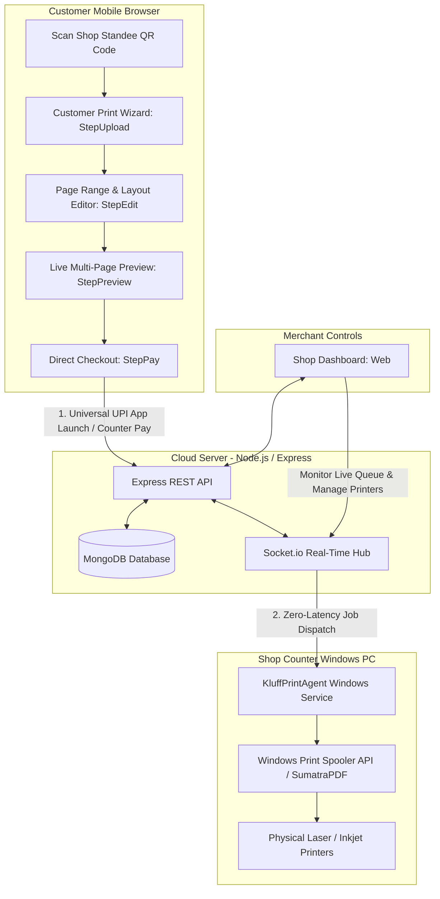
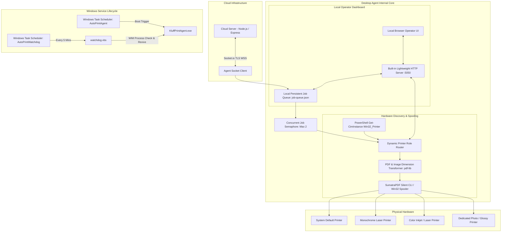

# ⚡ AutoPrint (Kluff) — Autonomous Cloud-to-Spooler Printing Engine

> **Zero-Touch, Real-Time Self-Service Print Ecosystem for Stationery Shops & Print Centers**  
> Enables customers to scan a shop QR code, configure page layouts, upload multi-file documents or photos, and dispatch jobs directly to physical Windows desktop printers without installing drivers or waiting in queue.

---

## 📑 Table of Contents
1. [Architecture Overview](#-architecture-overview)
2. [Print Agent Architecture & Specification](#-print-agent-architecture--specification)
3. [Implementation Plan: Hardware Routing & Agent UI](#-implementation-plan-hardware-routing--agent-ui)
4. [Key Features Implemented](#-key-features-implemented)
5. [Folder & Project Structure](#-folder--project-structure)
6. [Tech Stack](#-tech-stack)
7. [Getting Started & Local Setup](#-getting-started--local-setup)
8. [Windows Desktop Print Agent Installation](#-windows-desktop-print-agent-installation)
9. [API & WebSocket Specifications](#-api--websocket-specifications)
10. [Changelog & Recent Milestones](#-changelog--recent-milestones)

---

## 🏗 Architecture Overview



---

## 🖨 Print Agent Architecture & Specification

The **AutoPrint Desktop Agent** (`print-agent/`) bridges cloud-based print requests with physical Windows desktop printer spoolers. It requires zero printer drivers in the cloud and zero cloud exposure on the shop's local area network.



### 1. Socket Client & Auto-Healing Sync (`index.js`)
* **Persistent Bi-Directional Stream:** Connects to the cloud server via Socket.io with aggressive reconnection (`reconnectionDelay: 1000`, `reconnectionDelayMax: 5000`).
* **Initial Sync Request (`agent-request-pending-jobs`):** Immediately on connect/reconnect, broadcasts the agent's registration and requests any pending or stale jobs that were created while the agent PC was offline.
* **Download Retry Engine:** Implements exponential backoff (3 attempts) with integrity checks to download PDF/image assets safely before submitting to Windows spooler.

### 2. Local Queue Manager (`job-queue.json`)
* Protects print jobs against unexpected PC shutdowns, power cuts, or network dropouts.
* Incoming jobs are immediately persisted to `job-queue.json`.
* State transitions: `QUEUED` ➔ `DOWNLOADING` ➔ `SPOOLING` ➔ `COMPLETED` / `FAILED`.
* Completed jobs are archived and local temporary download caches are purged.

### 3. Hardware Discovery & Role-Based Routing
* Discovers installed physical and network printers dynamically via PowerShell:
  ```powershell
  Get-CimInstance Win32_Printer | Select-Object Name, Default, PrinterStatus, PortName
  ```
* **Dynamic Role Matrix (`config.json`):**
  * `defaultPrinter`: Fallback for general jobs.
  * `bwPrinter`: Automatically assigned to black-and-white impressions.
  * `colorPrinter`: Automatically assigned to color impressions.
  * `photoPrinter`: Assigned when customer selects photo print mode.
  * `largeFormatPrinter`: Assigned for A3, A2, or A1 paper formats.

### 4. Built-In Local Web UI (`http://localhost:5050`)
* Zero external web framework dependencies — runs directly on Node's native HTTP engine.
* **REST APIs:**
  * `GET /api/status`: Real-time cloud connectivity status, queue counts, and recent logs.
  * `GET /api/printers`: Discovered hardware printers and active role assignments.
  * `POST /api/printers/assign`: Updates printer routing rules on the fly without restarting the agent.
  * `POST /api/test-print`: Sends a 1-page alignment and diagnostic sheet directly to any printer.
  * `GET /api/queue`: Inspects real-time queue states and allows manual job retry.

### 5. Silent Spooling via SumatraPDF CLI
* Uses an integrated SumatraPDF executable to issue silent print instructions without displaying popup dialogues or dialog windows:
  ```cmd
  SumatraPDF.exe -print-to "<PRINTER_NAME>" -print-settings "<PAGES>,<DUPLEX_MODE>,paper=<SIZE>" "<FILE_PATH>"
  ```
* Handles page extraction, orientation corrections, and duplex discounts (`duplex: duplexlong` / `duplexshort`).

### 6. Windows Service & Auto-Start Architecture
To guarantee 24/7 reliability in retail shops without operator intervention, three automated scripts manage the Windows lifecycle:
* `install-service.bat`: One-click administrative setup. Registers Task Scheduler tasks, creates XML definitions, and enables High-Performance Power Plan.
* `uninstall-service.bat`: Cleans up and deletes Task Scheduler tasks and restores default balanced power plan.
* `watchdog.vbs`: Headless, silent VBScript executed every 5 minutes by Task Scheduler. Queries WMI process list for `KluffPrintAgent.exe` and restarts it if closed.

---

## 📋 Implementation Plan: Hardware Routing & Agent UI

### 1. Embedded Operator Web UI & Server (`http://localhost:5050`)
* **Zero External Dependencies:** Built natively inside `print-agent/index.js` using Node's standard `http` module.
* **Auto-Launch:** Automatically opens `http://localhost:5050` in the shopkeeper's browser on startup (suppressed in headless/service mode).
* **Core Operator Endpoints:**
  * `GET /api/status`: Real-time cloud connectivity status, Socket ID, queue count, and live log stream.
  * `GET /api/printers`: List of discovered Windows printers and active role assignments.
  * `POST /api/printers/assign`: Update hardware printer assignments dynamically in `config.json` without process restarts.
  * `POST /api/test-print`: 1-click test calibration sheet dispatched to any selected hardware printer.
  * `GET /api/queue`: Real-time queue view with options to retry or clear jobs.

### 2. Windows Native Hardware Printer Discovery
* **Asynchronous WMI Query:**
  ```powershell
  Get-CimInstance Win32_Printer | Select-Object Name, Default, PrinterStatus, PortName
  ```
* Identifies all USB, Network, and Virtual printers installed on the Windows PC.
* Automatically designates the system `Default` printer as fallback if no custom mappings are configured.

### 3. Role-Based Dynamic Routing Engine
When a job arrives from the cloud, the agent resolves the physical printer in the following hierarchy:
1. Specific `job.systemPrinterName` (if requested).
2. `largeFormatPrinter` (if paper size is A3, A2, or A1).
3. `photoPrinter` (if `jobType === 'photo'`).
4. `colorPrinter` (if `colorMode === 'color'`).
5. `bwPrinter` (if `colorMode === 'bw'`).
6. Fallback to `config.printers.defaultPrinter` or system default printer.

---

## 🚀 Key Features Implemented

### 1. 📱 Customer Web App (`client/`)
* **Multi-Step Checkout Wizard:**
  * **Step 1: Upload (`StepUpload.jsx`):** Drag-and-drop support for multi-page PDFs, DOCX, and image formats (`image/*`), featuring IndexedDB client-side caching (`fileStorage.js`) to prevent page reload loss.
  * **Step 2: Configuration & Editor (`StepEdit.jsx`):** Per-file color modes (B&W / Color), paper sizes (`A4`, `A3`, `Legal`), single/double-sided duplex options, custom page range extractors (`1-5, 8, 11`), copies slider, and live price calculator.
  * **Step 3: Document Preview (`StepPreview.jsx`):** High-fidelity canvas preview powered by PDF.js with zoom, thumbnail slider, and rotation.
  * **Step 4: Streamlined Checkout (`StepPay.jsx`):**
    * Two clean checkout modes: **Pay Online (UPI Apps)** and **Pay at Counter / Cash**.
    * **Direct Native UPI App Launch:** Clicking *"Pay via UPI"* launches `upi://pay`, directly prompting the user's phone to open their installed UPI apps (Google Pay, PhonePe, Paytm, BHIM, Cred) without intermediary web dialogs or manual number entry.
    * **Zero Web-QR Clutter:** Completely stripped out in-page QR code generators, camera scan overlays, and personal payee handles to adhere to modern mobile browser security and prevent app-switching errors.
    * **Auto-Return Detection:** Uses `visibilitychange` and `window.focus` event listeners to immediately detect when the user returns to the browser after making payment and automatically dispatches the job.
  * **Step 5: Live Order Tracking (`StepTracking.jsx`):** Real-time progress bar showing queue placement, file spooling, printing progress, and job completion.

### 2. 🛡️ Server & Security (`server/`)
* **Ephemeral QR Sessions:** Short-lived security tokens (`QRSession.js`) that expire after a configurable TTL to prevent stale link usage or off-premise print hijacking.
* **Instant WebSocket Room Synchronization:** `join-payment-room` and `payment_success` socket channels providing sub-second latency between customer confirmation and physical spool dispatch.
* **Cleaned Merchant Profile:** Stripped manual UPI ID inputs and payment QR upload cards from `ShopDashboard.jsx` and the backend database model (`Shop.js`) to eliminate configuration friction.

---

## 📁 Folder & Project Structure

```text
kluff/
├── client/                     # React + Vite customer frontend & owner dashboard
│   ├── public/                 # Static assets (brand logos: gpay, phonepe, paytm)
│   ├── src/
│   │   ├── components/customer/
│   │   │   ├── ProgressBar.jsx  # Multi-step checkout progress header
│   │   │   ├── SafeSlider.jsx   # Touch-friendly number of copies slider
│   │   │   ├── StepUpload.jsx   # Document & photo upload area
│   │   │   ├── StepEdit.jsx     # Print settings, duplex discount & page ranges
│   │   │   ├── StepPreview.jsx  # PDF.js multi-page canvas previewer
│   │   │   ├── StepPay.jsx      # Clean UPI intent checkout & counter pay
│   │   │   └── StepTracking.jsx # Real-time print job status tracker
│   │   ├── pages/
│   │   │   ├── CustomerPrint.jsx # Orchestrator page for customer workflow
│   │   │   ├── Home.jsx          # AutoPrint landing portal
│   │   │   ├── Login.jsx         # Shopkeeper authentication
│   │   │   ├── Register.jsx      # New shop registration
│   │   │   └── ShopDashboard.jsx # Live print queue & pricing controls
│   │   └── utils/
│   │       └── fileStorage.js   # IndexedDB client-side document persistence
├── print-agent/                # Windows desktop background print agent
│   ├── AGENT_ARCHITECTURE.md   # Detailed desktop agent architecture document
│   ├── KluffPrintAgent.exe     # Compiled standalone background agent binary
│   ├── config.json             # Shop token & printer hardware mapping
│   ├── index.js                # Core agent logic, spooler queue & socket client
│   ├── install-service.bat     # Windows administrative startup task installer
│   ├── uninstall-service.bat   # Service cleanup and task remover
│   ├── start-agent.bat         # Interactive terminal launcher for debugging
│   └── watchdog.vbs            # Silent liveness monitor
├── server/                     # Node.js + Express + Socket.io backend
│   ├── models/
│   │   ├── PrintJob.js         # MongoDB schema for print records & status
│   │   ├── QRSession.js        # Ephemeral customer session tokens
│   │   └── Shop.js             # Merchant account & pricing schema
│   ├── routes/
│   │   ├── dashboard.js        # Statistics, history & printer setup APIs
│   │   ├── printJob.js         # File upload & job creation endpoints
│   │   ├── session.js          # QR token validation & session generation
│   │   └── shop.js             # Shop metadata query endpoints
│   ├── sockets/
│   │   └── agentSocket.js      # Socket.io connection broker for desktop agent
│   └── server.js               # Main HTTP & WebSocket server entrypoint
├── start-autoprint.bat         # Single-click launcher for full stack
├── .gitignore                  # Git ignore rules for node_modules, env & logs
└── package.json                # Root orchestration scripts
```

---

## 💻 Tech Stack

* **Frontend:** React 18, Vite, Tailwind CSS, Lucide Icons, PDF.js, Socket.io-client.
* **Backend:** Node.js, Express, MongoDB (Mongoose), Socket.io, Multer, JWT.
* **Desktop Agent:** Node.js, Socket.io-client, SumatraPDF CLI, Windows Task Scheduler XML, VBScript Watchdog, `pkg`.

---

## 🛠 Getting Started & Local Setup

### Prerequisites
* **Node.js:** v18.x or higher installed.
* **MongoDB:** Community Server running locally (`net start MongoDB`) or MongoDB Atlas URI.
* **Git:** Installed and available in terminal path.

### 1. Clone the Repository
```bash
git clone https://github.com/chandan221012-netizen/kluff.git
cd kluff
```

### 2. Install Dependencies
Run the root helper command to install dependencies across all three packages:
```bash
npm run install:all
```
*(Or navigate individually into `server`, `client`, and `print-agent` and run `npm install`)*.

### 3. Environment Configuration
Create `server/.env` with your local settings:
```env
PORT=5000
MONGO_URI=mongodb://localhost:27017/autoprint
JWT_SECRET=your_secure_jwt_secret_key_here
SERVER_URL=http://localhost:5000
```

### 4. Running the Development Stack
You can start all services concurrently with one command from the project root:
```bash
npm run dev
```
Or launch them in separate terminal windows:
* **Terminal 1 (Backend Server):**
  ```bash
  cd server
  npm run dev
  ```
* **Terminal 2 (Frontend Client):**
  ```bash
  cd client
  npm run dev
  ```
* **Terminal 3 (Windows Print Agent):**
  ```bash
  cd print-agent
  npm start
  ```

### 5. Accessing Application Portals
* **Customer Print View (Test Session):** `http://localhost:5173/print/test-shop-token-123`
* **Shop Owner Login:** `http://localhost:5173/login` *(Default test login: `test@shop.com` / `123456`)*
* **Shop Owner Registration:** `http://localhost:5173/register`
* **Shop Dashboard:** `http://localhost:5173/dashboard`
* **Local Print Agent Dashboard:** `http://localhost:5050`

---

## 🖨 Windows Desktop Print Agent Installation

To install the agent permanently as an autonomous Windows background service on the shop PC:
1. Open `print-agent/config.json` and ensure your `serverUrl` and `shopToken` match your active shop profile.
2. Right-click `print-agent/install-service.bat` and select **"Run as administrator"**.
3. The script will automatically:
   * Register the `AutoPrintAgent` boot trigger task in Windows Task Scheduler.
   * Register the `AutoPrintWatchdog` 5-minute health-check task.
   * Configure Windows Power Plan to prevent standby sleep on AC power.
4. To uninstall or remove background tasks, right-click `print-agent/uninstall-service.bat` and select **"Run as administrator"**.

---

## 🔌 API & WebSocket Specifications

### REST Endpoints
| Method | Endpoint | Description |
|---|---|---|
| `GET` | `/api/session/:token` | Validate shop QR token and create customer session |
| `POST` | `/api/print/create` | Upload document file and submit print configuration |
| `POST` | `/api/verify-transaction` | Trigger real-time WebSocket payment release |
| `GET` | `/api/dashboard/stats` | Retrieve shop revenue, printer status, and job counts |
| `POST` | `/api/dashboard/pricing` | Update per-page pricing for B&W and color impressions |
| `GET` | `/api/dashboard/printers` | Retrieve registered printer hardware mappings |

### WebSocket Events (`Socket.io`)
| Event | Direction | Payload / Purpose |
|---|---|---|
| `join-payment-room` | Client ➔ Server | `{ orderId, sessionId }` — Binds customer to specific transaction channel |
| `payment_success` | Server ➔ Client | `{ orderId, status: 'SUCCESS' }` — Zero-delay print job dispatch |
| `agent:register` | Agent ➔ Server | `{ shopToken, printers }` — Handshake and printer availability check |
| `job:new` | Server ➔ Agent | `{ jobId, fileUrl, settings }` — Sends print payload directly to desktop spooler |
| `job:status` | Agent ➔ Server | `{ jobId, status: 'COMPLETED' \| 'FAILED' }` — Live queue progress updates |

---

## 📝 Changelog & Recent Milestones

* **Print Agent Architecture Integration:** Embedded full system architecture diagrams, persistent queue definitions, and silent spooler specs into [`README.md`](file:///E:/git_repo/kluff/README.md) and [`print-agent/AGENT_ARCHITECTURE.md`](file:///E:/git_repo/kluff/print-agent/AGENT_ARCHITECTURE.md).
* **Cleaned UPI Architecture:** Eliminated fragile individual app URL schemes (`phonepe://`, `gpay://`, `paytmmp://`) in favor of direct universal intent (`upi://pay`).
* **Zero QR Customer Interface:** Stripped out on-screen QR codes, standee photo uploads, and scan accordions from `StepPay.jsx`.
* **Owner Dashboard Simplification:** Completely removed manual UPI ID inputs, photo uploaders, and client-side canvas decoders from `ShopDashboard.jsx`.
* **Direct Mobile Launcher:** Enhanced `StepPay.jsx` to trigger the device's native UPI app chooser directly without intermediate bottom sheet modals.
* **Auto-Return Recovery:** Added browser visibility and window focus listeners to automatically dispatch orders upon returning from payment apps.
* **Portable Pathing:** Removed all machine-specific absolute folder paths across server and desktop scripts to ensure cross-computer compatibility.
