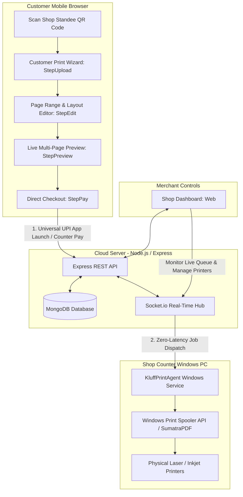

# ⚡ AutoPrint (Kluff) — Autonomous Cloud-to-Spooler Printing Engine

> **Zero-Touch, Real-Time Self-Service Print Ecosystem for Stationery Shops & Print Centers**  
> Enables customers to scan a shop QR code, configure page layouts, upload multi-file documents or photos, and dispatch jobs directly to physical Windows desktop printers without installing drivers or waiting in queue.

---

## 📑 Table of Contents
1. [Architecture Overview](#-architecture-overview)
2. [Key Features Implemented](#-key-features-implemented)
3. [Folder & Project Structure](#-folder--project-structure)
4. [Tech Stack](#-tech-stack)
5. [Getting Started & Local Setup](#-getting-started--local-setup)
6. [Windows Desktop Print Agent Installation](#-windows-desktop-print-agent-installation)
7. [API & WebSocket Specifications](#-api--websocket-specifications)
8. [Changelog & Recent Milestones](#-changelog--recent-milestones)

---

## 🏗 Architecture Overview



---

## 🚀 Key Features Implemented

### 1. 📱 Customer Web App (`client/`)
* **Multi-Step Checkout Wizard:**
  * **Step 1: Upload (`StepUpload.jsx`):** Drag-and-drop support for multi-page PDFs, DOCX, and image formats (`image/*`), featuring IndexedDB client-side caching (`fileStorage.js`) to prevent page reload loss.
  * **Step 2: Configuration & Editor (`StepEdit.jsx`):** Per-file color modes (B&W / Color), paper sizes (`A4`, `A3`, `Legal`), single/double-sided duplex options, custom page range extractors (`1-5, 8, 11`), copies slider, and live price calculator.
  * **Step 3: Document Preview (`StepPreview.jsx`):** High-fidelity canvas preview powered by PDF.js with zoom, thumbnail slider, and rotation.
  * **Step 4: Streamlined Checkout (`StepPay.jsx`):**
    * Two clean checkout modes: **Pay Online (UPI Apps)** and **Pay at Counter / Cash**.
    * **Direct Native UPI App Launch:** Clicking *"Pay via UPI"* launches `upi://pay`, directly prompting the user's phone to open their installed UPI apps (Google Pay, PhonePe, Paytm, BHIM, Cred) without intermediary web dialogs or manual number entry.
    * **Zero Web-QR Clutter:** Completely stripped out in-page QR code generators, camera scan overlays, and personal payee handles to adhere to modern mobile browser security and prevent app-switching errors.
    * **Auto-Return Detection:** Uses `visibilitychange` and `window.focus` event listeners to immediately detect when the user returns to the browser after making payment and automatically dispatches the job.
  * **Step 5: Live Order Tracking (`StepTracking.jsx`):** Real-time progress bar showing queue placement, file spooling, printing progress, and job completion.

### 2. 🖥️ Windows Print Agent (`print-agent/`)
* **Autonomous Native Windows Execution:** Standalone Node.js executable compiled with `pkg` (`KluffPrintAgent.exe`) that runs silently in the background on the shop counter PC.
* **Smart Printer Matching:** Automatically interrogates Windows WMI for installed local and network printers. Dispatches B&W jobs to high-speed monochromatic laser printers and color jobs to dedicated color/photo units based on shopkeeper mappings.
* **Direct Spooling via SumatraPDF / PowerShell:** Silent printing with precise page range, paper size, and duplex orientation arguments.
* **Self-Healing Watchdog Service:**
  * `install-service.bat`: One-click administrative installer that registers `AutoPrintAgent` and `AutoPrintWatchdog` via Windows Task Scheduler to start automatically on system boot.
  * `watchdog.vbs`: Background VBScript monitor checking process liveness every 5 minutes and reviving the agent if terminated.
  * Sets Windows power management to High Performance to prevent network sleep during idle periods.

### 3. 🛡️ Server & Security (`server/`)
* **Ephemeral QR Sessions:** Short-lived security tokens (`QRSession.js`) that expire after a configurable TTL to prevent stale link usage or off-premise print hijacking.
* **Instant WebSocket Room Synchronization:** `join-payment-room` and `payment_success` socket channels providing sub-second latency between customer confirmation and physical spool dispatch.
* **Cleaned Merchant Profile:** Stripped manual UPI ID inputs and payment QR upload cards from `ShopDashboard.jsx` and the backend database model (`Shop.js`) to eliminate configuration friction.

---

## 📁 Folder & Project Structure

```text
kluff/
├── client/                     # React + Vite customer frontend & owner dashboard
│   ├── public/                 # Static assets (brand logos: gpay, phonepe, paytm)
│   ├── src/
│   │   ├── components/customer/
│   │   │   ├── ProgressBar.jsx  # Multi-step checkout progress header
│   │   │   ├── SafeSlider.jsx   # Touch-friendly number of copies slider
│   │   │   ├── StepUpload.jsx   # Document & photo upload area
│   │   │   ├── StepEdit.jsx     # Print settings, duplex discount & page ranges
│   │   │   ├── StepPreview.jsx  # PDF.js multi-page canvas previewer
│   │   │   ├── StepPay.jsx      # Clean UPI intent checkout & counter pay
│   │   │   └── StepTracking.jsx # Real-time print job status tracker
│   │   ├── pages/
│   │   │   ├── CustomerPrint.jsx # Orchestrator page for customer workflow
│   │   │   ├── Home.jsx          # AutoPrint landing portal
│   │   │   ├── Login.jsx         # Shopkeeper authentication
│   │   │   ├── Register.jsx      # New shop registration
│   │   │   └── ShopDashboard.jsx # Live print queue & pricing controls
│   │   └── utils/
│   │       └── fileStorage.js   # IndexedDB client-side document persistence
├── print-agent/                # Windows desktop background print agent
│   ├── KluffPrintAgent.exe     # Compiled standalone background agent binary
│   ├── config.json             # Shop token & printer hardware mapping
│   ├── index.js                # Core agent logic, spooler queue & socket client
│   ├── install-service.bat     # Windows administrative startup task installer
│   ├── uninstall-service.bat   # Service cleanup and task remover
│   ├── start-agent.bat         # Interactive terminal launcher for debugging
│   └── watchdog.vbs            # Silent liveness monitor
├── server/                     # Node.js + Express + Socket.io backend
│   ├── models/
│   │   ├── PrintJob.js         # MongoDB schema for print records & status
│   │   ├── QRSession.js        # Ephemeral customer session tokens
│   │   └── Shop.js             # Merchant account & pricing schema
│   ├── routes/
│   │   ├── dashboard.js        # Statistics, history & printer setup APIs
│   │   ├── printJob.js         # File upload & job creation endpoints
│   │   ├── session.js          # QR token validation & session generation
│   │   └── shop.js             # Shop metadata query endpoints
│   ├── sockets/
│   │   └── agentSocket.js      # Socket.io connection broker for desktop agent
│   └── server.js               # Main HTTP & WebSocket server entrypoint
├── start-autoprint.bat         # Single-click launcher for full stack
├── .gitignore                  # Git ignore rules for node_modules, env & logs
└── package.json                # Root orchestration scripts
```

---

## 💻 Tech Stack

* **Frontend:** React 18, Vite, Tailwind CSS, Lucide Icons, PDF.js, Socket.io-client.
* **Backend:** Node.js, Express, MongoDB (Mongoose), Socket.io, Multer, JWT.
* **Desktop Agent:** Node.js, Socket.io-client, SumatraPDF CLI, Windows Task Scheduler XML, VBScript Watchdog, `pkg`.

---

## 🛠 Getting Started & Local Setup

### Prerequisites
* **Node.js:** v18.x or higher installed.
* **MongoDB:** Community Server running locally (`net start MongoDB`) or MongoDB Atlas URI.
* **Git:** Installed and available in terminal path.

### 1. Clone the Repository
```bash
git clone https://github.com/YOUR_USERNAME/kluff.git
cd kluff
```

### 2. Install Dependencies
Run the root helper command to install dependencies across all three packages:
```bash
npm run install:all
```
*(Or navigate individually into `server`, `client`, and `print-agent` and run `npm install`)*.

### 3. Environment Configuration
Create `server/.env` with your local settings:
```env
PORT=5000
MONGO_URI=mongodb://localhost:27017/autoprint
JWT_SECRET=your_secure_jwt_secret_key_here
SERVER_URL=http://localhost:5000
```

### 4. Running the Development Stack
You can start all services concurrently with one command from the project root:
```bash
npm run dev
```
Or launch them in separate terminal windows:
* **Terminal 1 (Backend Server):**
  ```bash
  cd server
  npm run dev
  ```
* **Terminal 2 (Frontend Client):**
  ```bash
  cd client
  npm run dev
  ```
* **Terminal 3 (Windows Print Agent):**
  ```bash
  cd print-agent
  npm start
  ```

### 5. Accessing Application Portals
* **Customer Print View (Test Session):** `http://localhost:5173/print/test-shop-token-123`
* **Shop Owner Login:** `http://localhost:5173/login` *(Default test login: `test@shop.com` / `123456`)*
* **Shop Owner Registration:** `http://localhost:5173/register`
* **Shop Dashboard:** `http://localhost:5173/dashboard`

---

## 🖨 Windows Desktop Print Agent Installation

To install the agent permanently as an autonomous Windows background service on the shop PC:
1. Open `print-agent/config.json` and ensure your `serverUrl` and `shopToken` match your active shop profile.
2. Right-click `print-agent/install-service.bat` and select **"Run as administrator"**.
3. The script will automatically:
   * Register the `AutoPrintAgent` boot trigger task in Windows Task Scheduler.
   * Register the `AutoPrintWatchdog` 5-minute health-check task.
   * Configure Windows Power Plan to prevent standby sleep on AC power.
4. To uninstall or remove background tasks, right-click `print-agent/uninstall-service.bat` and select **"Run as administrator"**.

---

## 🔌 API & WebSocket Specifications

### REST Endpoints
| Method | Endpoint | Description |
|---|---|---|
| `GET` | `/api/session/:token` | Validate shop QR token and create customer session |
| `POST` | `/api/print/create` | Upload document file and submit print configuration |
| `POST` | `/api/verify-transaction` | Trigger real-time WebSocket payment release |
| `GET` | `/api/dashboard/stats` | Retrieve shop revenue, printer status, and job counts |
| `POST` | `/api/dashboard/pricing` | Update per-page pricing for B&W and color impressions |
| `GET` | `/api/dashboard/printers` | Retrieve registered printer hardware mappings |

### WebSocket Events (`Socket.io`)
| Event | Direction | Payload / Purpose |
|---|---|---|
| `join-payment-room` | Client ➔ Server | `{ orderId, sessionId }` — Binds customer to specific transaction channel |
| `payment_success` | Server ➔ Client | `{ orderId, status: 'SUCCESS' }` — Zero-delay print job dispatch |
| `agent:register` | Agent ➔ Server | `{ shopToken, printers }` — Handshake and printer availability check |
| `job:new` | Server ➔ Agent | `{ jobId, fileUrl, settings }` — Sends print payload directly to desktop spooler |
| `job:status` | Agent ➔ Server | `{ jobId, status: 'COMPLETED' \| 'FAILED' }` — Live queue progress updates |

---

## 📝 Changelog & Recent Milestones

* **Cleaned UPI Architecture:** Eliminated fragile individual app URL schemes (`phonepe://`, `gpay://`, `paytmmp://`) in favor of direct universal intent (`upi://pay`).
* **Zero QR Customer Interface:** Stripped out on-screen QR codes, standee photo uploads, and scan accordions from `StepPay.jsx`.
* **Owner Dashboard Simplification:** Completely removed manual UPI ID inputs, photo uploaders, and client-side canvas decoders from `ShopDashboard.jsx`.
* **Direct Mobile Launcher:** Enhanced `StepPay.jsx` to trigger the device's native UPI app chooser directly without intermediate bottom sheet modals.
* **Auto-Return Recovery:** Added browser visibility and window focus listeners to automatically dispatch orders upon returning from payment apps.
* **Portable Pathing:** Removed all machine-specific absolute folder paths across server and desktop scripts to ensure cross-computer compatibility.
