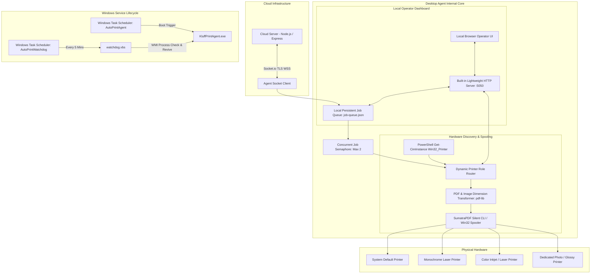

# 🖨️ AutoPrint Desktop Print Agent — System Architecture & Specification

> **Component:** `print-agent/`  
> **Target OS:** Windows 10 / 11 / Windows Server  
> **Execution Mode:** Standalone Compiled Binary (`KluffPrintAgent.exe`) or Background Windows Service with Watchdog  
> **Local UI Portal:** `http://localhost:5050`  

---

## 1. High-Level Architecture

The **AutoPrint Desktop Agent** bridges cloud-based print requests with physical Windows desktop printer spoolers. It requires zero printer drivers in the cloud and zero cloud exposure on the shop's local area network.



---

## 2. Core Modules & Components

### 2.1 Socket Client & Auto-Healing Sync (`index.js`)
* **Persistent Bi-Directional Stream:** Connects to the cloud server via Socket.io with aggressive reconnection (`reconnectionDelay: 1000`, `reconnectionDelayMax: 5000`).
* **Initial Sync Request (`agent-request-pending-jobs`):** Immediately on connect/reconnect, broadcasts the agent's registration and requests any pending or stale jobs that were created while the agent PC was offline.
* **Download Retry Engine:** Implements exponential backoff (3 attempts) with integrity checks to download PDF/image assets safely before submitting to Windows spooler.

### 2.2 Local Queue Manager (`job-queue.json`)
* Protects print jobs against unexpected PC shutdowns, power cuts, or network dropouts.
* Incoming jobs are immediately persisted to `job-queue.json`.
* State transitions: `QUEUED` ➔ `DOWNLOADING` ➔ `SPOOLING` ➔ `COMPLETED` / `FAILED`.
* Completed jobs are archived and local temporary download caches are purged.

### 2.3 Hardware Discovery & Role-Based Routing
* Discovers installed physical and network printers dynamically via PowerShell:
  ```powershell
  Get-CimInstance Win32_Printer | Select-Object Name, Default, PrinterStatus, PortName
  ```
* **Dynamic Role Matrix (`config.json`):**
  * `defaultPrinter`: Fallback for general jobs.
  * `bwPrinter`: Automatically assigned to black-and-white impressions.
  * `colorPrinter`: Automatically assigned to color impressions.
  * `photoPrinter`: Assigned when customer selects photo print mode.
  * `largeFormatPrinter`: Assigned for A3, A2, or A1 paper formats.

### 2.4 Built-In Local Web UI (`http://localhost:5050`)
* Zero external web framework dependencies — runs directly on Node's native HTTP engine.
* **REST APIs:**
  * `GET /api/status`: Real-time cloud connectivity status, queue counts, and recent logs.
  * `GET /api/printers`: Discovered hardware printers and active role assignments.
  * `POST /api/printers/assign`: Updates printer routing rules on the fly without restarting the agent.
  * `POST /api/test-print`: Sends a 1-page alignment and diagnostic sheet directly to any printer.
  * `GET /api/queue`: Inspects real-time queue states and allows manual job retry.

### 2.5 Silent Execution & SumatraPDF Spooling
* Uses an integrated SumatraPDF executable to issue silent print instructions without displaying popup dialogues or dialog windows:
  ```cmd
  SumatraPDF.exe -print-to "<PRINTER_NAME>" -print-settings "<PAGES>,<DUPLEX_MODE>,paper=<SIZE>" "<FILE_PATH>"
  ```
* Handles page extraction, orientation corrections, and duplex discounts (`duplex: duplexlong` / `duplexshort`).

---

## 3. Windows Service & Auto-Start Architecture

To guarantee 24/7 reliability in retail shops without operator intervention, three automated scripts manage the Windows lifecycle:

| File | Purpose |
|---|---|
| `install-service.bat` | One-click administrative setup. Registers Task Scheduler tasks, creates XML definitions, and enables High-Performance Power Plan. |
| `uninstall-service.bat` | Cleans up and deletes Task Scheduler tasks and restores default balanced power plan. |
| `watchdog.vbs` | Headless, silent VBScript executed every 5 minutes by Task Scheduler. Queries WMI process list for `KluffPrintAgent.exe` and restarts it if closed. |

### Windows Power Management Configuration:
```cmd
powercfg /setactive 8c5e7fda-e8bf-4a96-9a85-a6e23a8c635c
powercfg /change standby-timeout-ac 0
powercfg /change standby-timeout-dc 0
powercfg /change monitor-timeout-ac 0
powercfg /change hibernate-timeout-ac 0
powercfg /hibernate off
```
*Prevents counter PCs from going to sleep or disabling USB/Network ports while waiting for orders.*

---

## 4. Configuration Schema (`config.json`)

```json
{
  "serverUrl": "http://localhost:5000",
  "shopToken": "test-shop-token-123",
  "uiPort": 5050,
  "printers": {
    "defaultPrinter": "",
    "bwPrinter": "",
    "colorPrinter": "",
    "photoPrinter": "",
    "largeFormatPrinter": ""
  },
  "logLevel": "info",
  "maxConcurrentJobs": 2
}
```

---

## 5. Standalone Binary Compilation

To build a zero-dependency `.exe` for deployment on customer PCs without installing Node.js:
```bash
cd print-agent
npm run build
```
* Compiles `index.js` and embedded assets into `KluffPrintAgent.exe` (~78 MB self-contained binary).
