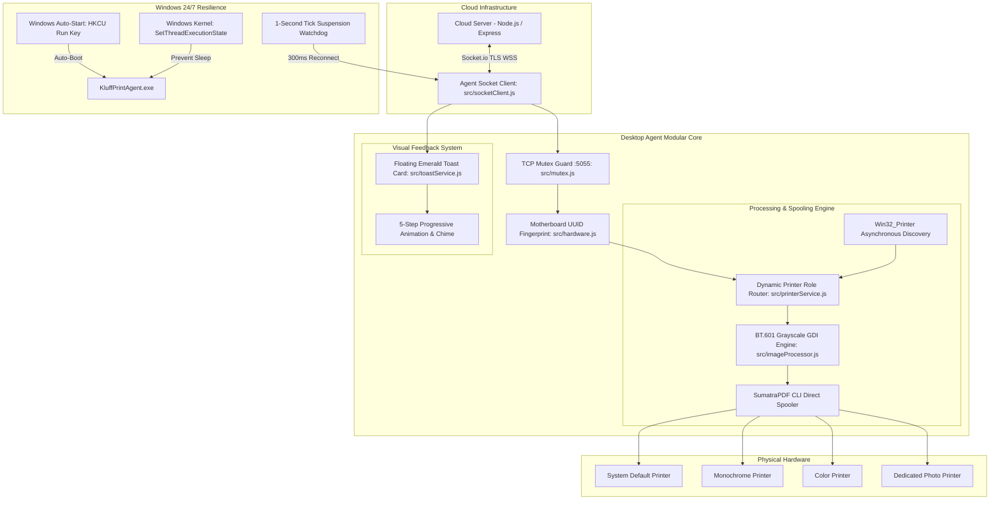

# 🖨️ AutoPrint Desktop Print Agent — System Architecture & Specification

> **Component:** `print-agent/`  
> **Target OS:** Windows 10 / 11 / Windows Server  
> **Execution Mode:** Standalone Compiled Pure-GUI Binary (`KluffPrintAgent.exe`)  
> **Subsystem:** Windows GUI (Subsystem 2 — 0 Console Windows, 0 Black Boxes)  
> **Visual Feedback:** Floating White & Emerald Green WPF Toast Card (`toast-ui.ps1`)  

---

## 1. High-Level Architecture

The **AutoPrint Desktop Agent** bridges cloud-based print requests with physical Windows desktop printer spoolers. It requires zero printer drivers in the cloud and zero cloud exposure on the shop's local area network.



---

## 2. Core Modular Structure (`src/`)

### 2.1 `src/socketClient.js` — Cloud Stream & Auto-Healing Sync
* **Persistent Bi-Directional Stream:** Connects to the cloud server via Socket.io with aggressive reconnection (`reconnectionDelay: 1000`, `reconnectionDelayMax: 5000`).
* **15s Active NAT Keep-Alive:** Emits `agent-ping` every 15s to keep router NAT tables open indefinitely, guaranteeing instant reception even after 6+ hours of inactivity.
* **Sleep / Wakeup Watchdog:** A 1-second interval monitors clock skew. If the PC resumes from sleep/suspend, it forces a clean reconnect in under 300ms.
* **Founder Killswitch:** Listens for `agent-control-command` (`LOCK` / `UNLOCK`) from the platform founder dashboard.

### 2.2 `src/toastService.js` — Zero-Console Floating Desktop Toast
* Autonomous floating WPF card sliding up in the bottom-right corner above the taskbar.
* Clean modern layout: File metadata, page count, price, copies, and payment badge (`UPI Mode` / `Cash Mode`).
* 5-step animated timeline with checkmarks and timestamps.
* Audio chime (`System.Media.SystemSounds.Asterisk`) on arrival.
* 15-second countdown dismiss button (`Close (15)`).
* Pure GUI execution: Spawned with `shell: false, windowsHide: true` so no black command prompt is ever created.

### 2.3 `src/printerService.js` — Windows Printer Discovery & Spooling
* Discovers all physical and network printers dynamically via PowerShell:
  ```powershell
  Get-CimInstance Win32_Printer | Select-Object Name, DeviceID, Default
  ```
* Direct silent spooling via bundled SumatraPDF without printer dialog popups:
  ```cmd
  SumatraPDF.exe -print-to "<PRINTER_NAME>" -silent "<FILE_PATH>"
  ```

### 2.4 `src/imageProcessor.js` — BT.601 High-Definition Photo Grayscale
* Converts photos (JPG, PNG, WebP) to high-definition BT.601 perceptual grayscale using Windows GDI ColorMatrix.
* Preserves skin tones, shadows, and midtones with realistic photographic depth on monochrome printers.

### 2.5 `src/activationService.js` — 1-Click Terminal Pairing
* White & Emerald Green modal dialog (`activate-ui.ps1`) for pairing the counter PC to a shop profile via its unique QR token.

### 2.6 `src/mutex.js` — Single Instance Guard
* TCP server listening on `127.0.0.1:5055` ensuring strictly one agent instance runs per PC.

### 2.7 `src/hardware.js` — Machine Fingerprinting
* Queries Motherboard UUID or `MachineGuid` to prevent token hijacking.

---

## 3. Zero-Touch Windows Auto-Start Deployment

To install the agent permanently on counter PCs:
1. Double-click **`install-autostart.bat`**.
2. Automatically registers `KluffPrintAgent.exe` in `HKCU\Software\Microsoft\Windows\CurrentVersion\Run`.
3. Sets Windows Power Policy (`powercfg /change standby-timeout-ac 0`) so the counter PC never sleeps on AC power.
4. On every PC reboot, the agent launches silently in the background with zero clicks.
